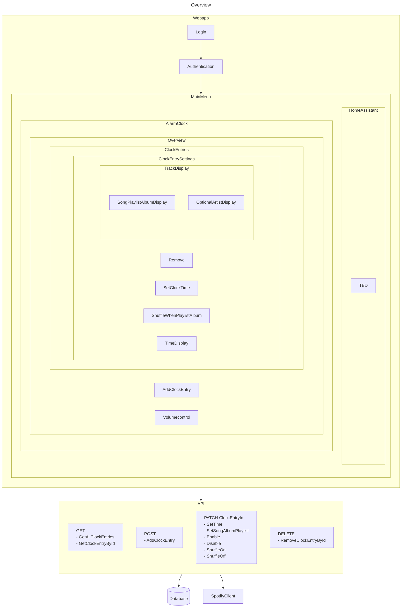

# Requirements

## Outline
### Motivation
This should primarily be a learning project for getting into Angular and web programming in general. The result, however
should still be a cool product to use. 

For a long time I have had the desire to be able to set songs from Spotify as an alarm clock. But since I prefer to turn
off my phone at night, using a standard app available at the App/Play Store was not really an option. 
I am also dreaming of building my own alarm clock in a retro design using Nixie tubes. This project will however only
focus on the alarm clock part and not the nixie tubes.

### Description

The alarm clock should consist of two components - hardware and software. It should provide a web (or app) interface where
one can set wake-up songs, albums, artists and/or playlists. It should also integrate a player for volume control and casually 
listening to music during the day. Furthermore, one should be able to set the volume and activate the clock in hardware
by means of knobs and potentiometers. Ideally, the system is to be integrated into a smart home system such as home assistant
or IFTTT.

## Components
### Hardware

| Component                          | Description                                            |
|------------------------------------|--------------------------------------------------------|
| Raspberry Pi Zero                  | This will provide the brains of the alarm clock        |
| Adafruit I2S 3W Speaker Bonnet     | Audio Interface between speakers and Raspberry Pi Zero |
| 2x Visaton SC 5.9 ND 4 Ohm Speaker | Speakers playing the audio                             |
| Push buttons, Potentiometers, LEDs | For fast control, still TBD                            |

### Software

#### Spotify Client
There are two options to make the Raspberry Pi Zero a Spotify Client:
    - cspot: https://github.com/feelfreelinux/cspot
    - spotifyd: https://github.com/Spotifyd/spotifyd
They are still to be evaluated

#### Backend
A small API should be written to receive commands and store data such as selected songs on the Raspberry Pi. This will
also contain a simple database to store configurations.

#### Frontend: Webapp
The Web-UI is written in HTML/Typescript using the Angular Framework.